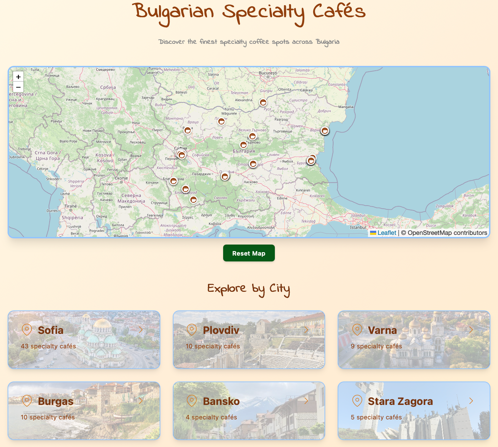

# ☕ Bulgarian Specialty Cafés

A beautiful, interactive web application showcasing specialty coffee shops across Bulgaria. Built with vanilla JavaScript, OpenStreetMap integration, and a warm, coffee-inspired design.



## 🌟 Features

- **Interactive Maps**: OpenStreetMap integration showing all specialty cafes across Bulgaria
- **City Navigation**: Browse cafes by city with dedicated city pages
- **Detailed Cafe Information**: View photos, addresses, and working hours for each cafe
- **Bilingual Support**: Toggle between English and Bulgarian languages
- **Responsive Design**: Works seamlessly on desktop, tablet, and mobile devices
- **Free & Open Source**: No API keys required, completely free to use and modify

## 🚀 Live Demo

[View Live Site](#) *(Add your GitHub Pages URL here)*

## 📁 Project Structure

```
specialty-coffee-bulgaria/
├── index.html          # Main HTML structure
├── style.css           # All styling and responsive design
├── app.js              # JavaScript logic and map functionality
├── data.js             # Cafe data (easy to edit!)
├── images/
│   ├── cafes/          # Cafe photos
│   └── site-images/    # Site assets (logos, icons, etc.)
└── README.md           # This file
```

## 🛠️ Technologies Used

- **HTML5** - Semantic markup
- **CSS3** - Modern styling with gradients and animations
- **Vanilla JavaScript** - No frameworks, pure JS
- **Leaflet.js** - Interactive map library
- **OpenStreetMap** - Free map tiles and data

## 📦 Installation

1. **Clone the repository**
   ```bash
   git clone https://github.com/yourusername/specialty-coffee-bulgaria.git
   cd specialty-coffee-bulgaria
   ```

2. **Open in browser**
   - Simply open `index.html` in your web browser
   - Or use a local server (recommended):
     ```bash
     # Using Python
     python -m http.server 8000
     
     # Using Node.js
     npx serve
     
     # Using VS Code Live Server extension
     Right-click index.html → Open with Live Server
     ```

3. **View in browser**
   - Navigate to `http://localhost:8000` (or the port your server uses)

## ✏️ Adding Your Own Cafes

The project is designed to be easy to customize! All cafe data is in `data.js`.

### Adding a New Cafe

1. Open `data.js`
2. Find the city where you want to add the cafe
3. Copy an existing cafe object and modify it:

```javascript
{
    id: 9,                                    // Unique ID
    name: 'Your Cafe Name',
    address: 'Street Address, City',
    coords: { lat: 42.1234, lng: 23.5678 },  // Get from OpenStreetMap
    hours: 'Mon-Sun: 9:00-18:00',
    image: 'images/cafes/your-cafe.jpg'      // Add photo to images/cafes/
}
```

### Adding a New City

```javascript
newcity: {
    name: 'New City',
    coords: { lat: 42.1234, lng: 23.5678 },
    image: 'images/cities/newcity.jpg',       // Optional city header image
    cafes: [
        // Add cafe objects here
    ]
}
```

### Getting Coordinates

1. Go to [OpenStreetMap](https://www.openstreetmap.org)
2. Search for the cafe or address
3. Right-click on the exact location
4. Click "Show address"
5. Copy coordinates from the URL: `#map=19/42.69500/23.32000`
6. Use as: `lat: 42.69500, lng: 23.32000`

## 🎨 Customization

### Changing Colors

Edit `style.css` to modify the color scheme. The current palette uses warm coffee tones:

- Primary: `#78350f` (Dark brown)
- Secondary: `#92400e` (Medium brown)
- Accent: `#d97706` (Amber)
- Background: Gradient from `#fffbeb` to `#fef3c7`

### Adding Images

- **Cafe photos**: Add to `images/cafes/` (recommended: 800x600px, under 500KB)
- **City headers**: Add to `images/cities/` (recommended: 1200x400px)
- **Site assets**: Add to `images/site-images/`

## 🌍 Deployment

### GitHub Pages (Free Hosting)

1. **Push to GitHub**
   ```bash
   git add .
   git commit -m "Initial commit"
   git push origin main
   ```

2. **Enable GitHub Pages**
   - Go to repository Settings
   - Navigate to Pages section
   - Select "main" branch
   - Click Save

3. **Access your site**
   - Your site will be live at: `https://yourusername.github.io/repo-name`

### Alternative Hosting

The project works with any static site host:
- Netlify
- Vercel
- Cloudflare Pages
- Firebase Hosting

## 📱 Browser Support

- ✅ Chrome/Edge (latest)
- ✅ Firefox (latest)
- ✅ Safari (latest)
- ✅ Mobile browsers (iOS Safari, Chrome Mobile)

## 🤝 Contributing

Contributions are welcome! If you'd like to add cafes or improve the project:

1. Fork the repository
2. Create a feature branch (`git checkout -b feature/new-cafes`)
3. Commit your changes (`git commit -m 'Add cafes in Ruse'`)
4. Push to the branch (`git push origin feature/new-cafes`)
5. Open a Pull Request

## 📝 License

This project is open source and available under the [MIT License](LICENSE).

## 🙏 Acknowledgments

- Map tiles from [OpenStreetMap](https://www.openstreetmap.org/copyright) contributors
- Map functionality powered by [Leaflet.js](https://leafletjs.com/)
- Coffee icons and imagery from various sources

## 📧 Contact

Have questions or suggestions? Feel free to:
- Open an issue on GitHub
- Contact: [pateO_Opate@proton.me]

---

**Built with ☕ and ❤️ for the Bulgarian specialty coffee community**
